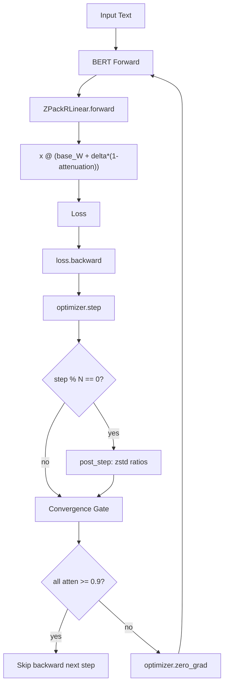
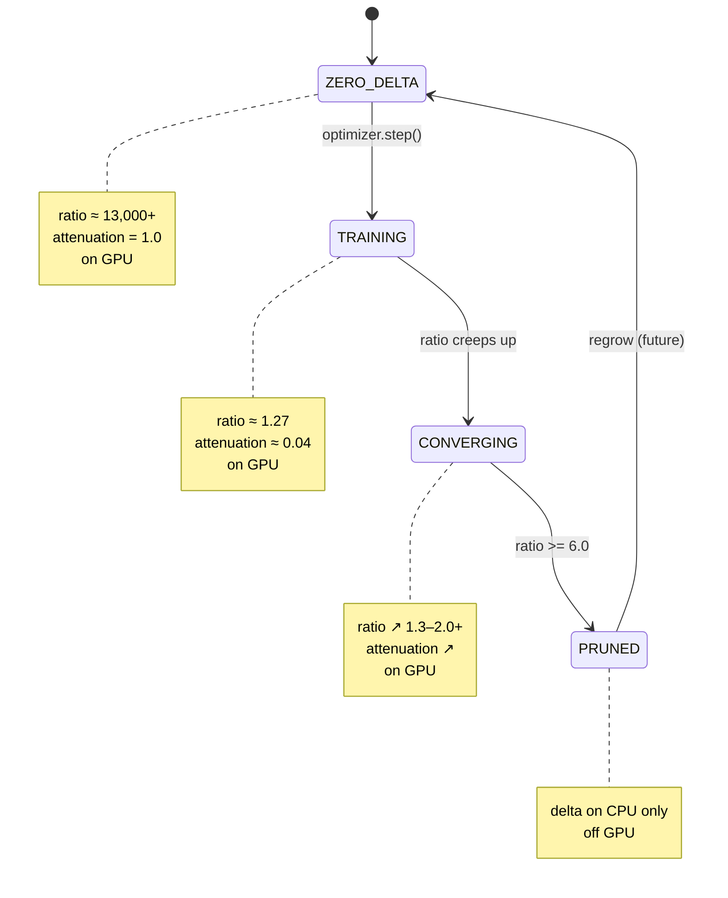

# ZPackR — Block-Level System Flowchart

## 1. System Overview

```
                      ┌─────────────────────────────────────────┐
                      │              TRAINING LOOP               │
                      │                                         │
 Input Text ──────────▶  HuggingFace BERT forward               │
 (tokenized)           │      │                                  │
                       │      ▼                                  │
                       │  ZPackRLinear.forward()                 │
                       │  x @ (base_W + delta*(1-attenuation))   │
                       │      │                                  │
                       │      ▼                                  │
                       │  loss.backward()                        │
                       │      │                                  │
                       │      ▼                                  │
                       │  optimizer.step()   ← FusedQuantizedAdam│
                       │      │                                  │
                       │      ├─ every N steps: post_step()      │
                       │      │    zstd.compress(block) → ratio  │
                       │      │    ratio → attenuation factors   │
                       │      │                                  │
                       │      ├─ every step: convergence gate    │
                       │      │    all blocks ≥ 0.9? → skip      │
                       │      │                                  │
                       │      └─ optimizer.zero_grad()            │
                       └─────────────────────────────────────────┘
                                      │
                                      ▼
                               Predictions
```



---

## 2. Per-Step Detail

```
STEP N (every step):
═══════════════════════════════════════════════════════════════════

  ┌──────────────────────────────────────────────────────────────┐
  │ 1. FORWARD                                                   │
  │                                                              │
  │   x = batch.to(device)          # [M, in_features]           │
  │                                                              │
  │   For each ZPackRLinear layer:                               │
  │     if all blocks salient:                                   │
  │       nv = tensor(attenuation_factors).repeat_interleave(256)│
  │       W = base_W + delta_salient * (1.0 - nv)                │
  │       out = x @ W                                            │
  │     elif partial salience:                                   │
  │       W = base_W.clone()                                     │
  │       scatter attenuated delta into W via index_add_         │
  │       out = x @ W                                            │
  │                                                              │
  │   loss = outputs.loss / grad_accum_steps                     │
  └──────────────────────────────────────────────────────────────┘
                              │
                              ▼
  ┌──────────────────────────────────────────────────────────────┐
  │ 2. CONVERGENCE GATE                                          │
  │                                                              │
  │   if all(layer._attenuation_factors >= 0.9                  │
  │           for layer in zpl_layers):                          │
  │       gate_skipped = True                                    │
  │       → skip backward, record step                           │
  │   else:                                                      │
  │       gate_skipped = False                                   │
  └──────────────────────────────────────────────────────────────┘
                              │ (if not skipped)
                              ▼
  ┌──────────────────────────────────────────────────────────────┐
  │ 3. BACKWARD                                                  │
  │                                                              │
  │   loss.backward()                                            │
  │   → gradients flow through attenuated delta                  │
  │   → fully-attenuated blocks get ~0 gradient                  │
  │   → base_W gets 0 gradient (frozen)                         │
  └──────────────────────────────────────────────────────────────┘
                              │
                              ▼
  ┌──────────────────────────────────────────────────────────────┐
  │ 4. OPTIMIZER                                                 │
  │                                                              │
  │   optimizer.step()                                           │
  │   → FusedQuantizedAdam updates delta_salient on GPU          │
  │   → (optional) VelvetController adjusts per-layer LRs         │
  │   → optimizer.zero_grad()                                    │
  └──────────────────────────────────────────────────────────────┘
```

---

## 3. post_step Detail (every post_step_interval steps)

```
STEP where step % post_step_interval == 0:
═══════════════════════════════════════════════════════════════════

  ┌──────────────────────────────────────────────────────────────┐
  │ 1. SYNC DELTA TO CPU                                         │
  │                                                              │
  │   module._sync_full_delta()                                  │
  │   → if _staged_cpu available: use fast path                  │
  │   → else: delta_salient.cpu()                                │
  │   → scatter compacted GPU view into _full_delta [in, out]    │
  └──────────────────────────────────────────────────────────────┘
                              │
                              ▼
  ┌──────────────────────────────────────────────────────────────┐
  │ 2. PER-BLOCK zstd COMPRESSION                                │
  │                                                              │
  │   delta_np = _full_delta.view(uint8).contiguous().numpy()    │
  │   block_el_bytes = block_size * out_features * 2             │
  │                                                              │
  │   for blk in range(num_blocks):                              │
  │       byte_start = blk * block_el_bytes                      │
  │       byte_end   = min(byte_start + block_el_bytes, nbytes)  │
  │                                                              │
  │       # Variance gate: skip if delta L2 unchanged > 15%      │
  │       if abs(l2 - prev_l2) / prev_l2 < 0.15:                │
  │           reuse cached ratio                                 │
  │           continue                                           │
  │                                                              │
  │       blk_bytes = delta_np[byte_start:byte_end].tobytes()    │
  │       compressed = zstd.compress(blk_bytes)                  │
  │       ratio = len(blk_bytes) / len(compressed)                │
  │       # ~1.27 for non-zero delta, ~13,000 for zero delta     │
  └──────────────────────────────────────────────────────────────┘
                              │
                              ▼
  ┌──────────────────────────────────────────────────────────────┐
  │ 3. ATTENUATION MAPPING                                       │
  │                                                              │
  │   RATIO_FLOOR = 1.0    # minimum possible ratio              │
  │   RATIO_CEILING = 8.0  # ratio at which block is "known"    │
  │                                                              │
  │   for r in ratios:                                           │
  │       attenuation = clamp((r - 1.0) / 7.0, 0.0, 1.0)        │
  │                                                              │
  │   Examples:                                                  │
  │     ratio=1.27 → atten=(1.27-1)/7 = 0.039  (3.9% suppressed)│
  │     ratio=1.50 → atten=(1.50-1)/7 = 0.071  (7.1% suppressed)│
  │     ratio=2.00 → atten=(2.00-1)/7 = 0.143  (14.3%)          │
  │     ratio=13,000 → atten=capped at 1.0    (100% suppressed)  │
  └──────────────────────────────────────────────────────────────┘
                              │
                              ▼
  ┌──────────────────────────────────────────────────────────────┐
  │ 4. PRUNING (VRAM management)                                 │
  │                                                              │
  │   use_threshold = RATIO_CEILING * 0.75   # = 6.0            │
  │                                                              │
  │   for each block:                                            │
  │       if ratio < 6.0 → KEEP in delta_salient (novel)        │
  │       if ratio >= 6.0 → PRUNE from delta_salient (known)    │
  │                                                              │
  │   If mask changed:                                           │
  │       _rebuild_delta_salient()  # re-compact GPU view        │
  └──────────────────────────────────────────────────────────────┘
                              │
                              ▼
  ┌──────────────────────────────────────────────────────────────┐
  │ 5. CACHE RESULTS                                             │
  │                                                              │
  │   _block_gaps = ratios          # for variance gating        │
  │   _attenuation_factors = [...]  # for forward matmul         │
  │   _ratio_cache = None           # invalidated               │
  │                                                              │
  │   → Used in next N forward passes until next post_step       │
  └──────────────────────────────────────────────────────────────┘
```

---

## 4. Block State Machine

A single block (256 × out_features) goes through these states:

```
                              ┌──────────────┐
                    ┌────────▶│    ZERO      │ delta = 0
                    │         │    DELTA     │ ratio ≈ 13,000+
                    │         │              │ attenuation = 1.0
                    │         │   on GPU ✓   │
                    │         └──────┬───────┘
                    │                │ optimizer.step()
                    │                │ delta becomes non-zero
                    │                ▼
                    │         ┌──────────────┐
                    │         │  TRAINING    │ delta ≠ 0
                    │         │   BLOCK      │ ratio ≈ 1.27
                    │         │              │ attenuation ≈ 0.04
                    │         │   on GPU ✓   │
                    │         └──────┬───────┘
                    │                │ ratio creeps up as delta
                    │                │ develops compressible structure
                    │                ▼
                    │         ┌──────────────┐
                    │         │ CONVERGING   │ delta ≠ 0
                    │         │   BLOCK      │ ratio ↗ 1.3 → 2.0+
                    │         │              │ attenuation ↗
                    │         │   on GPU ✓   │
                    │         └──────┬───────┘
                    │                │
                    │    ┌───────────┴───────────┐
                    │    │                       │
                    │    │ ratio ≥ 6.0           │ ratio < 6.0
                    │    ▼                       │
                    │ ┌──────────────┐          │ continues training
                    │ │   PRUNED     │          │
                    │ │   BLOCK      │ delta preserved on CPU
                    │ │              │ not in delta_salient
                    │ │  off GPU ✗   │
                    │ └──────┬───────┘
                    │        │
                    │        │ delta changes enough to
                    │        │ become novel again
                    │        │ (future: regrow)
                    │        │
                    └────────┘
```



---

## 5. Signal Flow — Compression Chain

```
FULL DELTA MATRIX [in_features × out_features] bf16
│
│  Split into blocks of size BLOCK_SIZE (256)
│
├── Block 0: rows [0:256]     × out_features  → 256*out*2 bytes
│                                              → zstd.compress()
│                                              → ratio_0
│
├── Block 1: rows [256:512]   × out_features  → 256*out*2 bytes
│                                              → zstd.compress()
│                                              → ratio_1
│
├── Block 2: rows [512:768]   × out_features  → ...
│
│   ... (num_blocks = ceil(in_features / 256))
│
└── Block N-1: rows [N*256:in] × out_features → ...

                    │
                    ▼

    For each block i: attenuation[i] = clamp((ratio_i - 1.0) / 7.0, 0, 1)

                    │
                    ▼

    FORWARD:  combined delta contribution = delta[i] * (1 - attenuation[i])
              → applied per block in the cuBLAS matmul

    GATE:     if all(attenuation[i] >= 0.9 for all i in all layers)
              → should_skip_backward() = True
```

---

## 6. Convergence Gate Decision

```
Every training step, before backward:

  For each ZPackRLinear layer (0..23):
      factors = layer._attenuation_factors
      if factors is None:
          return False  ← no factors yet → keep training

      if any(f < 0.9 for f in factors):
          return False  ← at least one block still novel

  return True  ← ALL blocks across ALL layers are fully attenuated

                   │
                   ├── True  → skip backward (gate_skipped = True)
                   └── False → loss.backward() + optimizer.step()

Future: when gate skip rate > threshold (e.g. 95%),
          training auto-terminates.
```

---

## 7. Checkpoint — Save/Restore

```
SAVE:
  for each ZPackRLinear layer:
      sync delta GPU → CPU
      zstd.compress(full_delta bytes) → .zstd file
      torch.save(base_W) → .base_W file
      torch.save(block_mask) → .mask file
      torch.save(metadata) → .meta file

RESTORE:
  zstd.decompress(.zstd file) → full_delta bf16
  load base_W, block_mask
  rebuild delta_salient from kept blocks
```

---

## Data Flow Summary (ASCII)

```
                 ┌──────────────┐
                 │  INPUT TEXT  │
                 └──────┬───────┘
                        │ tokenize
                 ┌──────▼───────┐
                 │  BERT MODEL  │
                 │  (modified)  │
                 └──────┬───────┘
                        │
          ┌─────────────┼─────────────┐
          │             │             │
     Layer 0       Layer 1      Layer 11
     ┌──────┐      ┌──────┐      ┌──────┐
     │base_W│      │base_W│      │base_W│
     │+delta│      │+delta│      │+delta│
     │*(1-a)│      │*(1-a)│      │*(1-a)│
     └──┬───┘      └──┬───┘      └──┬───┘
        │              │              │
        │   ┌──────────┴──────────┐   │
        │   │  LOSS & BACKWARD    │   │
        │   └──────────┬──────────┘   │
        │              │              │
        │   ┌──────────▼──────────┐   │
        │   │  OPTIMIZER.STEP()   │   │
        │   │  (FusedQuantizedAdam)│  │
        │   └──────────┬──────────┘   │
        │              │              │
        │   ┌──────────▼──────────┐   │
        │   │    post_step()      │   │
        │   │  zstd per block     │   │
        │   │  → attenuation      │   │
        │   └──────────┬──────────┘   │
        │              │              │
        └──────────────┼──────────────┘
                       │
                ┌──────▼───────┐
                │  PREDICTIONS │
                └──────────────┘
```
